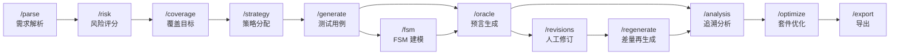

# AutoTestDesign

> AI-Assisted Black-Box Test Design Tool — 同济大学 2026 春《软件测试》课程设计

**AutoTestDesign** 是一个面向任意结构化/半结构化需求文档的**普适性黑盒测试设计工具**。输入 SRS 等需求文本，经由 LLM (DeepSeek) 驱动的多 Agent 协作流水线，阶段性地输出：**需求解析 → 风险评分 → 覆盖策略 → 测试用例 → FSM 模型 → Oracle 预言 → 套件优化 → 结构化导出**，覆盖黑盒测试设计的完整生命周期。

选定的被测应用 (AUT) 为 **LibraryManagementSystem**，一个基于 Spring Boot REST API 的图书管理、会员管理、借阅与归还服务。

---

## 目录

- [核心工作流](#核心工作流)
- [功能特性](#功能特性)
- [被测应用 (AUT)](#被测应用-aut)
- [项目架构](#项目架构)
- [目录结构](#目录结构)
- [技术栈](#技术栈)
- [快速开始](#快速开始)
- [测试](#测试)
- [CI/CD 质量门禁](#cicd-质量门禁)
- [角色分工](#角色分工)
- [文档索引](#文档索引)

---

## 核心工作流



| 步骤 | 接口 | 功能描述 | 核心输出 |
|:---:|------|----------|----------|
| 1 | `POST /ingest` → `POST /parse` | 需求摄入与结构解析：提取输入字段、数据范围、前置条件、业务规则、期望动作 | `ParsedRequirement[]` |
| 2 | `POST /risk` | 风险评估：AI 评定每个需求的影响度 (1-5)、发生概率 (1-5)、风险等级 (High/Medium/Low)、测试优先级 (P1/P2/P3) | `RiskResult[]` |
| 3 | `POST /coverage` → `POST /strategy` | 覆盖目标识别 + 测试技术分配：EP (等价类划分)、BVA (边界值分析)、DT (判定表测试)，附策略依据 | `CoverageItem[]`, `Strategy[]` |
| 4 | `POST /generate` → `POST /fsm` → `POST /oracle` | 测试设计规格 + 测试用例起草 + FSM 状态机建模 + Oracle 预言审查（置信度/人工复核标记） | `TestCase[]`, `FsmResult`, `OracleResult[]` |
| 5 | `POST /revisions` → `POST /regenerate` | 人工修订追踪 + 受影响项差量再生成 + 缺口分析 | `RevisionLog[]`, 更新后的全链路工件 |
| 6 | `POST /optimize` → `GET/POST /export` | 套件优化 (set_cover / risk_priority) + 多格式导出 (JSON / CSV / XLSX) | `OptimizationResult`, `ExportBundle` |

此外，前端还提供 **SSE 流式流水线**（实时进度展示）与**后台流水线**（一键启动全流程，前端级联轮询各阶段结果）。

---

## 功能特性

### 需求摄入与解析
- 支持 `.txt`、`.pdf`、`.docx`、`.doc` 文件上传及文本直接输入
- AI 将非结构化需求解析为结构化字段（输入数据、数据范围、条件、业务规则、期望动作）
- 支持 RAG 增强：利用 ChromaDB 向量检索注入标准/历史文档上下文

### 风险分析与覆盖策略
- LLM 自动评估每条需求的风险影响度与发生概率，计算综合风险分数
- 自动生成覆盖目标 (CoverageGoal)，并分配黑盒测试技术 (EP/BVA/DT)
- 全覆盖项与需求的可追溯性链路

### 测试设计与生成
- 测试设计规格 (TestDesignSpec) 与测试用例草案 (TestCaseDraft) 双重生成
- FSM 状态机建模：识别状态、事件、条件、动作，生成迁移表、覆盖路径和 Mermaid 状态图
- Oracle 预言审查：为每条用例生成/复核期望结果，输出置信度和人工复核标记

### 人工修订与差量再生成
- 设计者修改任意工件后自动生成 RevisionLog (before/after 比较)
- 自动判定受影响范围，仅重新生成被影响的链路段
- 缺口分析：标记未覆盖/可改进/需人工审查项

### 套件优化与导出
- 两种优化模式：`set_cover` (最小覆盖集) 和 `risk_priority` (风险优先级排序)
- 保留高风险唯一覆盖项
- 导出格式：JSON (完整 ExportBundle)、CSV、XLSX
- 可选包含修订记录、Prompt 证据、仅已审批用例

### 评估与证据
- Prompt 全链路记录 (PromptEvidence)，支持审计追溯
- RAGAS 评估框架支持（Golden QA 数据集 + 自动评估）
- pytest 框架下的 AUT API 冒烟测试

---

## 被测应用 (AUT)

> **LibraryManagementSystem** — Spring Boot REST API

```text
默认地址: http://localhost:8080
```

| API 域 | 说明 |
|--------|------|
| Book Management | 图书 CRUD |
| Member Management | 会员 CRUD |
| Borrowing Records | 借阅记录管理 |
| Borrowing Workflow | 借阅流程（状态迁移） |
| Return Workflow | 归还流程（状态迁移） |
| Error Handling | 异常路径处理 |

AUT 需求基线文档：[`docs/srs/AUT_SRS_IEEE830_v1.md`](docs/srs/AUT_SRS_IEEE830_v1.md)

---

## 项目架构

```
┌────────────┐       HTTP / SSE        ┌──────────────────────────────────┐
│   React    │ ◄──────────────────────► │          uvicorn 进程            │
│  Frontend  │                          │                                  │
│  (Vite)    │                          │  ┌──────────┐    import         │
└────────────┘                          │  │   app/   │ ────────────►     │
                                        │  │  Web 层  │                   │
                                        │  │          │ ◄────────────     │
                                        │  │ FastAPI  │    返回值         │
                                        │  └──────────┘                   │
                                        │       │                         │
                                        │       │    import               │
                                        │       ▼                         │
                                        │  ┌──────────┐    import         │
                                        │  │  agent/  │ ────────────►     │
                                        │  │ AI编排层 │                   │
                                        │  │          │ ◄────────────     │
                                        │  │ LLM+RAG  │  ┌──────────┐    │
                                        │  └──────────┘  │   rag/   │    │
                                        │       │         │  检索层  │    │
                                        │       └─────────│ ChroDB   │    │
                                        │                 └──────────┘    │
                                        └──────────────────────────────────┘
```

三层均在**同一进程**内运行，通过 Python `import` 直接调用（非 HTTP/RPC）：

| 层 | 职责 | 禁止 |
|----|------|------|
| **app/** — Web 层 | 接收前端请求、参数校验、调用 agent/rag 接口、组装响应 | 拼接 Prompt、调 LLM API、操作向量数据库、写业务逻辑 |
| **agent/** — AI 编排层 | Prompt 管理、LLM API 调用、结构化解析、多 Agent 流水线 | import app/、访问 HTTP 路由 |
| **rag/** — 检索层 | 文档摄入切分、Embedding 向量化、语义检索 | import app/ 或 agent/ |

### Agent 层内部架构

```
agent/
├── core/         # AgentContext、基类、领域模型 (models.py)
├── roles/        # 9 个专项 Agent (解析/分析/风险/覆盖/策略/规格/用例)
├── pipeline/     # 流水线编排 (7 阶段)、收尾 (ID 规范化、追溯校验、质量门禁)
├── tools/        # LLM 客户端、RAG 客户端、输出验证器、ID 规范化器、追溯检查器
├── prompts/      # Prompt 模板与注册表
├── revision/     # 修订影响分析与差量再生成
├── runner.py     # 完整流程同步/SSE 流式入口
└── revision_runner.py  # 差量再生成入口
```

---

## 目录结构

```
.
├── .github/                    # GitHub Actions CI + PR/Issue 模板
│   ├── workflows/ci.yml        # 主 CI 流水线 (Project Quality Gate)
│   ├── pull_request_template.md
│   └── ISSUE_TEMPLATE/
│
├── backend/                    # Python 后端 (FastAPI)
│   ├── main.py                 # FastAPI 工厂入口
│   ├── requirements.txt        # Python 依赖
│   ├── .env                    # 环境变量 (API Key 等, gitignored)
│   ├── app/                    # Web 层 — HTTP 路由与模块
│   │   ├── core/               # 配置、异常、依赖注入
│   │   └── modules/            # 按功能步骤拆分的模块组
│   │       ├── intake_parse/   # 需求摄入与解析
│   │       ├── concept_risk/   # 风险分析
│   │       ├── coverage_strategy/ # 覆盖策略
│   │       ├── test_design/    # 测试设计、FSM、Oracle
│   │       ├── evidence_improve/ # 人工修订与差量再生
│   │       ├── optimize_export/ # 套件优化与导出
│   │       ├── fsm/            # 独立 FSM 生成器
│   │       ├── store.py        # 内存会话存储 (WorkflowStore)
│   │       ├── pipeline_bg.py  # 后台流水线运行器
│   │       └── util.py         # 工具函数
│   ├── agent/                  # AI 编排层
│   │   ├── core/               # AgentContext, BaseAgent, models.py
│   │   ├── roles/              # 9 个专项 Agent
│   │   ├── pipeline/           # 流水线、阶段、收尾
│   │   ├── tools/              # LLM客户端、RAG客户端、验证器、格式化
│   │   ├── prompts/            # Prompt 模板与注册
│   │   ├── revision/           # 修订影响分析
│   │   ├── runner.py           # 同步与 SSE 流式入口
│   │   └── revision_runner.py  # 差量再生成入口
│   └── rag/                    # 检索层 — ChromaDB 向量存储 + 语义检索
│       ├── rag_service.py      # 公开接口
│       ├── loader.py           # Markdown 文档加载
│       ├── chunker.py          # 文本切分 (800字符chunk, 120重叠)
│       ├── vector_store.py     # ChromaDB + sentence-transformers
│       ├── build_index.py      # 索引构建脚本
│       └── data/               # raw/ 和 processed/ 文档存储
│
├── frontend/                   # React + TypeScript 前端 (Vite)
│   ├── package.json
│   ├── vite.config.mjs
│   └── src/
│       ├── app/                # App 外壳、路由、全局状态 (Zustand)
│       ├── modules/            # 步骤页面组件
│       │   ├── requirements/   # Step 1: 需求摄入页
│       │   ├── risk-analysis/  # Step 2-3: 风险 + 覆盖策略页
│       │   ├── test-design/    # Step 4-5: 测试设计 + 证据/修订页
│       │   └── export/         # Step 6: 优化导出页
│       └── shared/             # API 客户端、类型定义、公共组件
│
├── docs/                       # 共享文档
│   ├── srs/AUT_SRS_IEEE830_v1.md   # AUT 需求规格说明 (IEEE 830)
│   ├── 软件需求文档.md              # 工具自身软件需求文档
│   ├── 后端接口对接文档.md           # 后端 API 对接文档
│   ├── 前端展示对接文档.md           # 前端展示对接文档
│   ├── runner流式后端接口对接文档.md  # SSE 流式对接文档
│   ├── revision_runner优化设计.md   # 差量再生成优化设计
│   ├── branch_policy.md            # 分支与 CI 门禁规则
│   ├── RAGAS/                      # RAGAS 评估方案
│   └── test/                       # 测试框架依据
│
├── Testing/                    # Python 测试套件
│   ├── conftest.py             # pytest fixtures 与 markers
│   ├── tests/                  # 测试文件
│   │   ├── test_static_artifacts.py      # 静态文档检查
│   │   ├── test_app_module_layout.py     # 模块结构 & 路由注册检查
│   │   ├── test_agent_validation.py      # Agent 验证
│   │   ├── test_runner_fr45_orchestration.py # 流水线编排检查
│   │   ├── test_fsm_*.py                # FSM 专项测试 (7 个文件)
│   │   ├── test_oracle_*.py             # Oracle 专项测试
│   │   └── aut/                         # Live AUT API 测试 (非 CI)
│   └── data/                   # 测试夹具数据
│
├── localDocs/                  # 本地文档 (gitignored)
├── external/                   # 外部 AUT 源码 (gitignored)
├── requirements-dev.txt        # Python 测试依赖
└── README.md                   # 本文件
```

---

## 技术栈

### 前端

| 技术 | 版本 | 用途 |
|------|------|------|
| React | ^19.2 | UI 框架 |
| TypeScript | ~6.0 | 类型安全 |
| Vite | ^8.0 | 构建工具 & 开发服务器 |
| Ant Design (antd) | ^6.3 | UI 组件库 |
| Zustand | ^5.0 | 全局状态管理 |
| Mermaid | ^11.15 | FSM 状态图渲染 |

### 后端

| 技术 | 版本 | 用途 |
|------|------|------|
| FastAPI | >=0.110 | Python 异步 Web 框架 |
| Uvicorn | >=0.27 | ASGI 服务器 |
| Pydantic | >=2.6 | 数据校验与序列化 |
| ChromaDB | >=1.0 | 向量数据库 (RAG) |
| sentence-transformers | >=3.0 | 文本 Embedding (bge-small-zh-v1.5) |
| PyMuPDF | >=1.24 | PDF 解析 |
| python-docx | >=1.1 | DOCX 解析 |
| DeepSeek | deepseek-v4-flash | LLM (OpenAI 兼容 API) |

### 测试

| 技术 | 版本 | 用途 |
|------|------|------|
| pytest | >=8.0 | 测试框架 |
| requests | >=2.31 | HTTP 客户端 (AUT API 测试) |

---

## 快速开始

### 环境要求

- **Python** >= 3.11
- **Node.js** >= 22
- **npm** >= 10

### 1. 后端

```bash
cd backend
pip install -r requirements.txt

配置环境变量（创建 backend/.env 文件）
DEEPSEEK_API_KEY=<your-api-key>
DEEPSEEK_BASE_URL=https://api.deepseek.com
DEEPSEEK_MODEL=deepseek-v4-flash
CORS_ORIGINS=http://localhost:5173

uvicorn backend.main:app --reload --port 8000
```

API 文档自动生成于：`http://localhost:8000/docs`

### 2. 前端

```bash
cd frontend
npm install
npm run dev      # 启动于 http://127.0.0.1:5173
```

生产构建：

```bash
npm run build
```

### 3. RAG 索引构建（可选）

```bash
cd backend

# 将 Markdown 文档放入 backend/rag/data/processed/
python -m rag.build_index
```

### 环境变量参考

| 变量 | 说明 | 默认值 |
|------|------|--------|
| `DEEPSEEK_API_KEY` | LLM API Key | (必填) |
| `DEEPSEEK_BASE_URL` | LLM 服务端点 | `https://api.deepseek.com` |
| `DEEPSEEK_MODEL` | 模型名称 | `deepseek-v4-flash` |
| `CORS_ORIGINS` | 允许的前端来源 | `http://localhost:5173` |
| `RAG_ENABLED` | 是否启用 RAG 增强 | `true` |
| `API_HOST` | 服务监听地址 | `0.0.0.0` |
| `API_PORT` | 服务监听端口 | `8000` |

---

## 测试

### 安装测试依赖

```bash
pip install -r requirements-dev.txt
```

### 运行测试

```bash
cd Testing

# CI 安全测试（不含 live AUT、RAGAS、LLM）
pytest -m "not aut_api and not ragas and not llm" -q

# Live AUT API 测试（需先启动 LibraryManagementSystem）
pytest -m aut_api -q

# 自定义 AUT 地址
AUT_BASE_URL=http://localhost:8081 pytest -m aut_api -q

# 全部测试
pytest -q
```

### 测试标记 (Markers)

| Marker | 说明 | CI 运行 |
|--------|------|:------:|
| `aut_api` | 依赖外部 AUT 运行时的 Live API 测试 | 否 |
| `ragas` | RAGAS 评估测试 (需 LLM) | 条件 |
| `llm` | 依赖 LLM API 调用的测试 | 否 |
| (无标记) | 静态检查、模块结构、逻辑校验 | 是 |

---

## CI/CD 质量门禁

`Project Quality Gate` (`.github/workflows/ci.yml`) 在 PR 到 `main` / `develop` 时自动运行：

| 门禁 | 内容 |
|------|------|
| **PR Policy Gate** | 分支流向校验，阻止 `localDocs/` / `external/` 提交 |
| **Conditional Builds** | 前端 `npm run build` + 后端 Python 编译检查 |
| **Python Test Suite** | CI 安全 pytest (无 live AUT / RAGAS / LLM) |
| **RAGAS Gate** | 当存在 `@pytest.mark.ragas` 测试时运行 |

分支策略：

```
develop ◄── feat/* / fix/* / docs/* / test/*
   │
   ▼
  main      (仅接受来自 develop 的 PR)
```

详见 [`docs/branch_policy.md`](docs/branch_policy.md)。

---
