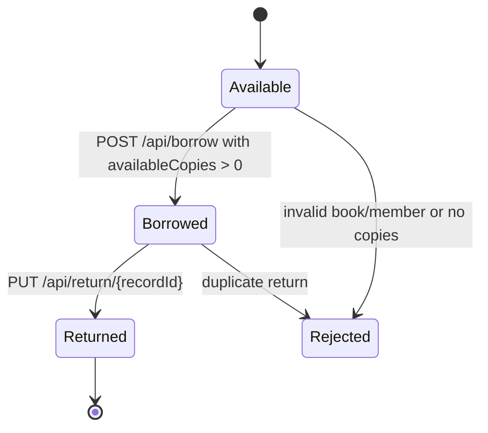

# AUT Software Requirements Specification

## 1. Introduction

### 1.1 Purpose

This Software Requirements Specification defines the behavior of the selected Application Under Test (AUT), a Spring Boot Library Management System. The SRS is used as the requirement source for AutoTestDesign parsing, risk analysis, test design generation, oracle evaluation, and integration testing.

### 1.2 Scope

The AUT provides REST APIs for managing books, members, and borrowing records. It supports creating, reading, updating, and deleting books and members, borrowing available books, returning borrowed books, and listing borrowing records.

### 1.3 Source Basis

No complete SRS was found in the AUT repository. This document is derived from:

- `README.md`
- `LibraryController.java`
- `LibraryService.java`
- `Book.java`
- `Member.java`
- `BorrowingRecord.java`
- Manual API probing against `http://localhost:8080`

### 1.4 AUT Baseline

| Item | Value |
|---|---|
| Repository | `https://github.com/msaswata15/LibraryManagementSystem` |
| Branch | `copilot/fix-398405b9-7572-4792-9850-4f677476485c` |
| Commit | `2188543` |
| Runtime URL | `http://localhost:8080` |
| Main API Prefix | `/api` |
| Data Storage | In-memory lists |

## 2. Overall Description

### 2.1 Product Perspective

The AUT is a standalone Spring Boot REST API. It stores runtime data in memory, so data is reset when the service restarts. It has no frontend, authentication, authorization, database persistence, or OpenAPI specification in the selected baseline.

### 2.2 User Classes

| User Class | Description |
|---|---|
| Librarian | Maintains book and member records and handles borrowing/return operations |
| API Client | Sends HTTP requests to create, read, update, delete, borrow, and return resources |
| Test Automation | Executes repeatable API tests against the running service |

### 2.3 Assumptions

1. The AUT service is running on `http://localhost:8080`.
2. Dates use ISO-8601 format: `YYYY-MM-DD`.
3. IDs are generated by the service for created books, members, and borrowing records.
4. Created data remains available only for the lifetime of the running process.
5. Validation is limited to the behavior implemented in the selected baseline.

## 3. Data Requirements

### 3.1 Book

| Field | Type | Required | Description |
|---|---|---|---|
| `id` | integer | response only | Generated book identifier |
| `title` | string | yes | Book title |
| `author` | string | yes | Book author |
| `publicationYear` | integer | yes | Publication year |
| `genre` | string | yes | Book genre/category |
| `availableCopies` | integer | yes | Number of copies currently available |

### 3.2 Member

| Field | Type | Required | Description |
|---|---|---|---|
| `id` | integer | response only | Generated member identifier |
| `name` | string | yes | Member full name |
| `email` | string | yes | Member email address |
| `phoneNumber` | string | yes | Member phone number |
| `startDate` | date | yes | Membership start date |
| `endDate` | date | yes | Membership end date |

### 3.3 BorrowingRecord

| Field | Type | Required | Description |
|---|---|---|---|
| `id` | integer | response only | Generated borrowing record identifier |
| `book.id` | integer | request yes | Existing book ID |
| `member.id` | integer | request yes | Existing member ID |
| `borrowDate` | date | response only | Date when the book is borrowed |
| `dueDate` | date | response only | Due date, set to borrow date + 14 days |
| `returnDate` | date or null | response/update | Date when the book is returned |

## 4. Functional Requirements

### FR-AUT-BOOK-001 List Books

The system shall return all books when the API client sends `GET /api/books`.

Acceptance criteria:

- Response status is `200 OK`.
- Response body is a JSON array.

### FR-AUT-BOOK-002 Get Book by ID

The system shall return one book when the API client sends `GET /api/books/{id}` with an existing book ID.

Acceptance criteria:

- Existing ID returns `200 OK` and a Book object.
- Missing ID returns `404 Not Found`.

### FR-AUT-BOOK-003 Create Book

The system shall create a book when the API client sends `POST /api/books` with a valid Book payload.

Acceptance criteria:

- Response status is `201 Created`.
- Response body contains the submitted fields.
- Response body contains a generated `id`.

### FR-AUT-BOOK-004 Update Book

The system shall update a book when the API client sends `PUT /api/books/{id}` with an existing book ID.

Acceptance criteria:

- Existing ID returns `200 OK`.
- Response body uses the path ID as `id`.
- Missing ID returns `404 Not Found`.

### FR-AUT-BOOK-005 Delete Book

The system shall delete a book when the API client sends `DELETE /api/books/{id}` with an existing book ID.

Acceptance criteria:

- Existing ID returns `204 No Content`.
- A later `GET /api/books/{id}` returns `404 Not Found`.
- Missing ID returns `404 Not Found`.

### FR-AUT-MEMBER-001 List Members

The system shall return all members when the API client sends `GET /api/members`.

Acceptance criteria:

- Response status is `200 OK`.
- Response body is a JSON array.

### FR-AUT-MEMBER-002 Get Member by ID

The system shall return one member when the API client sends `GET /api/members/{id}` with an existing member ID.

Acceptance criteria:

- Existing ID returns `200 OK` and a Member object.
- Missing ID returns `404 Not Found`.

### FR-AUT-MEMBER-003 Create Member

The system shall create a member when the API client sends `POST /api/members` with a valid Member payload.

Acceptance criteria:

- Response status is `201 Created`.
- Response body contains the submitted fields.
- Response body contains a generated `id`.

### FR-AUT-MEMBER-004 Update Member

The system shall update a member when the API client sends `PUT /api/members/{id}` with an existing member ID.

Acceptance criteria:

- Existing ID returns `200 OK`.
- Response body uses the path ID as `id`.
- Missing ID returns `404 Not Found`.

### FR-AUT-MEMBER-005 Delete Member

The system shall delete a member when the API client sends `DELETE /api/members/{id}` with an existing member ID.

Acceptance criteria:

- Existing ID returns `204 No Content`.
- A later `GET /api/members/{id}` returns `404 Not Found`.
- Missing ID returns `404 Not Found`.

### FR-AUT-BORROW-001 List Borrowing Records

The system shall return all borrowing records when the API client sends `GET /api/borrowing-records`.

Acceptance criteria:

- Response status is `200 OK`.
- Response body is a JSON array.

### FR-AUT-BORROW-002 Borrow Available Book

The system shall create a borrowing record when the API client sends `POST /api/borrow` with an existing book ID, an existing member ID, and at least one available copy.

Acceptance criteria:

- Response status is `201 Created`.
- Response body contains a generated borrowing record `id`.
- `borrowDate` is set to the current date.
- `dueDate` is set to current date + 14 days.
- `returnDate` is `null`.
- The book's `availableCopies` decreases by 1.

### FR-AUT-BORROW-003 Reject Missing or Invalid Book

The system shall reject a borrow request when `book.id` is missing or does not reference an existing book.

Acceptance criteria:

- Response status is `400 Bad Request`.
- No borrowing record is created.

### FR-AUT-BORROW-004 Reject Missing or Invalid Member

The system shall reject a borrow request when `member.id` is missing or does not reference an existing member.

Acceptance criteria:

- Response status is `400 Bad Request`.
- No borrowing record is created.

### FR-AUT-BORROW-005 Reject Borrowing When No Copies Are Available

The system shall reject a borrow request when the target book has `availableCopies <= 0`.

Acceptance criteria:

- Response status is `400 Bad Request`.
- No borrowing record is created.
- The book's `availableCopies` does not become negative.

### FR-AUT-RETURN-001 Return Borrowed Book

The system shall return a borrowed book when the API client sends `PUT /api/return/{recordId}` for an existing, unreturned borrowing record.

Acceptance criteria:

- Response status is `200 OK`.
- The borrowing record's `returnDate` is set.
- The related book's `availableCopies` increases by 1.

### FR-AUT-RETURN-002 Reject Missing Borrowing Record

The system shall reject a return request when `recordId` does not reference an existing borrowing record.

Acceptance criteria:

- Response status is `400 Bad Request`.

### FR-AUT-RETURN-003 Reject Duplicate Return

The system shall reject a return request when the borrowing record has already been returned.

Acceptance criteria:

- First return returns `200 OK`.
- Second return for the same `recordId` returns `400 Bad Request`.

## 5. State Model

The borrowing lifecycle can be modeled as:

## 6. Non-Functional Requirements

| ID | Requirement |
|---|---|
| NFR-AUT-001 | The API shall use JSON request and response bodies. |
| NFR-AUT-002 | The API shall use standard HTTP status codes for success and failure. |
| NFR-AUT-003 | The API shall be executable locally with Java 17+ and Maven 3.6+. |
| NFR-AUT-004 | Test automation shall be able to call the API through `http://localhost:8080`. |

## 7. Known Limitations

1. Data is stored in memory and is lost on restart.
2. There is no authentication or authorization.
3. There is no explicit Bean Validation on request models.
4. Error responses do not include detailed JSON error bodies.
5. There is no official OpenAPI or Swagger document.
