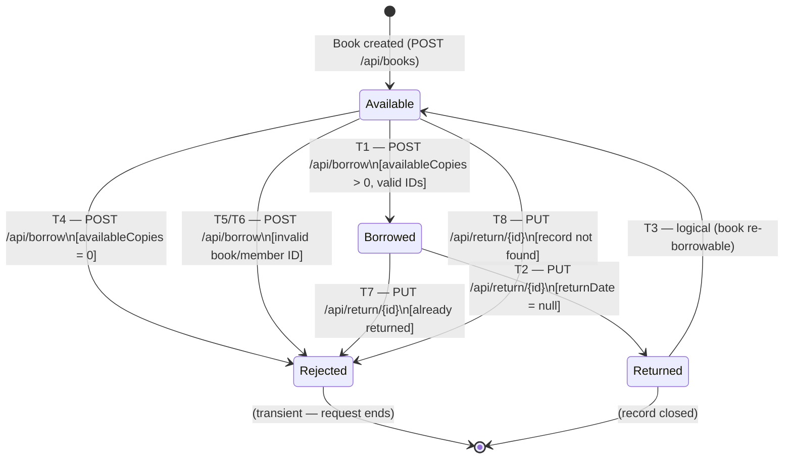

# Software Requirements Specification

**Library Management System — Application Under Test**

| Field | Value |
|---|---|
| Document ID | AUT-SRS-001 |
| Version | 1.0 |
| Prepared by | D (Test & Documentation Lead) |
| Prepared date | 2026-05-11 |
| Standard | IEEE Std 830-1998 (adapted) |
| Status | Baseline |

---

## Revision History

| Version | Date | Author | Description |
|---|---|---|---|
| 1.0 | 2026-05-11 | D | Initial baseline derived from README, source code inspection, and manual API probing |

---

## Table of Contents

1. [Introduction](#1-introduction)
   - 1.1 Purpose
   - 1.2 Scope
   - 1.3 Definitions, Acronyms, and Abbreviations
   - 1.4 References
   - 1.5 Overview
2. [Overall Description](#2-overall-description)
   - 2.1 Product Perspective
   - 2.2 Product Functions
   - 2.3 User Classes and Characteristics
   - 2.4 Operating Environment
   - 2.5 Design and Implementation Constraints
   - 2.6 Assumptions and Dependencies
3. [Specific Requirements](#3-specific-requirements)
   - 3.1 External Interface Requirements
   - 3.2 Functional Requirements
   - 3.3 Behaviour Requirements (State Model)
4. [Data Requirements](#4-data-requirements)
   - 4.1 Data Models
   - 4.2 Data Constraints and Ranges
5. [Non-Functional Requirements](#5-non-functional-requirements)
6. [Known Limitations](#6-known-limitations)

---

## 1. Introduction

### 1.1 Purpose

This Software Requirements Specification (SRS) describes the observable functional behaviour, data model, state transitions, and constraints of the Library Management System (hereafter **AUT**), a Spring Boot REST API application. The document is the authoritative requirement source for the **AutoTestDesign** tool and serves four purposes:

1. Provide structured input to AutoTestDesign FR 1.0 (Input Ingestion) and FR 1.1 (Requirement Parsing).
2. Provide the data ranges and constraint definitions needed by FR 3.0 (Black-Box Test Generation: EP, BVA, Decision Table).
3. Provide the state model needed by FR 4.0 (White-Box FSM Modeling).
4. Define the 15-sample requirement set used by D to evaluate FR 1.1 parsing accuracy on Day 3–4.

**Intended readers:** AutoTestDesign team members A, B, C, D, E; anyone reviewing test case designs or oracle outputs against the AUT.

### 1.2 Scope

The AUT is a self-contained Spring Boot REST API server that manages three resource types: **Books**, **Members**, and **Borrowing Records**. It supports:

- Creating, reading, updating, and deleting book records.
- Creating, reading, updating, and deleting member records.
- Borrowing available books (with copy-count management).
- Returning borrowed books.
- Listing all borrowing records.

**Out of scope for this SRS:** frontend (the `/frontend` directory exists but is not part of the API under test), authentication, authorization, database persistence (data is in-memory), and scheduled tasks.

### 1.3 Definitions, Acronyms, and Abbreviations

| Term | Definition |
|---|---|
| AUT | Application Under Test — the Library Management System |
| SRS | Software Requirements Specification (this document) |
| FR | Functional Requirement |
| NFR | Non-Functional Requirement |
| EP | Equivalence Partitioning (ISTQB FL §4.2.2) |
| BVA | Boundary Value Analysis (ISTQB FL §4.2.3) |
| DT | Decision Table Testing (ISTQB FL §4.2.4) |
| ST | State Transition Testing (ISTQB FL §4.2.5) |
| FSM | Finite State Machine |
| REST | Representational State Transfer |
| HTTP | Hypertext Transfer Protocol |
| JSON | JavaScript Object Notation |
| ISO 8601 | International date format standard: `YYYY-MM-DD` |
| `availableCopies` | The count of physical copies of a book that are currently not borrowed |
| Borrow record | A server-created entity linking a Member, a Book, a borrow date, and a due date |
| Active borrow | A borrow record whose `returnDate` is `null` |
| Returned borrow | A borrow record whose `returnDate` is non-null |

### 1.4 References

| ID | Document |
|---|---|
| REF-01 | `README.md` — msaswata15/LibraryManagementSystem (commit 2188543) |
| REF-02 | `src/main/java/com/app/library/controller/LibraryController.java` |
| REF-03 | `src/main/java/com/app/library/service/LibraryService.java` |
| REF-04 | `src/main/java/com/app/library/model/Book.java` |
| REF-05 | `src/main/java/com/app/library/model/Member.java` |
| REF-06 | `src/main/java/com/app/library/model/BorrowingRecord.java` |
| REF-07 | Manual API probing against `http://localhost:8080` (D, Day 2) |
| REF-08 | `AUT真实Endpoint记录.md` — verified request/response samples |
| REF-09 | `AUT测试覆盖矩阵.md` — requirement-to-test mapping (Day 2) |
| REF-10 | IEEE Std 830-1998, IEEE Recommended Practice for Software Requirements Specifications |
| REF-11 | ISTQB Foundation Level Syllabus 2023 |
| REF-12 | ISO/IEC/IEEE 29119-4 (Software Testing — Test Techniques) |

### 1.5 Overview

Section 2 provides the overall system context, user classes, and constraints. Section 3 defines all functional requirements, organized by resource module and supplemented by a state model. Section 4 specifies the data models and the quantitative constraints required for EP/BVA test design. Section 5 covers non-functional requirements. Section 6 documents known limitations discovered during baseline inspection.

---

## 2. Overall Description

### 2.1 Product Perspective

The AUT is a **standalone** Spring Boot application. It has no dependency on external services, databases, or message queues in the selected baseline. All runtime data is held in memory within `LibraryService` and is lost when the process is restarted. There is no OpenAPI/Swagger document in the repository; this SRS was reverse-engineered from source code and live API probing.

The AUT does **not** interact with the AutoTestDesign tool during test execution — the two systems are independent. AutoTestDesign generates test cases from this SRS; those test cases are later executed by pytest against the running AUT.

### 2.2 Product Functions

The following is a high-level summary. Full details are in Section 3.

| Module | Functions |
|---|---|
| Book Management | List all books; retrieve a book by ID; create a book; update a book by ID; delete a book by ID |
| Member Management | List all members; retrieve a member by ID; create a member; update a member by ID; delete a member by ID |
| Borrowing | List all borrowing records; borrow an available book (with copy-count decrement); return a borrowed book (with copy-count increment) |

### 2.3 User Classes and Characteristics

| User Class | Description | Technical Level |
|---|---|---|
| Librarian | Human operator who manages book/member records and processes borrow/return transactions | Low — uses a future frontend or direct HTTP client |
| API Client | Application or script that calls the REST API programmatically | Medium — understands HTTP and JSON |
| Test Automation | pytest test suite (D) that exercises all endpoints against the live AUT for verification | High — constructs request payloads and validates response contracts |

### 2.4 Operating Environment

- **Runtime:** Java 17 or higher; Maven 3.6 or higher.
- **Server:** Spring Boot embedded Tomcat, listening on `http://localhost:8080`.
- **Database:** H2 in-memory (default); configurable in `application.properties`.
- **Network:** Local loopback only in the test environment; no external network access required.

### 2.5 Design and Implementation Constraints

- All request and response bodies are JSON (`Content-Type: application/json`).
- Date fields use ISO 8601 format (`YYYY-MM-DD`).
- Resource IDs are server-generated integers; clients must not supply an `id` on creation requests.
- No Bean Validation annotations are applied on request models in the selected baseline; validation is implemented in `LibraryService` logic only.
- No authentication or authorization is implemented; all endpoints are publicly accessible.

### 2.6 Assumptions and Dependencies

1. The AUT process is running and healthy at `http://localhost:8080` before any test is executed.
2. The in-memory store is empty at application start; each test session begins in a clean state.
3. The server clock is used for `borrowDate`; tests must not depend on a specific date value.
4. `dueDate` is always `borrowDate + 14 days` (derived from `LibraryService` source code).
5. `availableCopies` is the sole gating condition for whether a borrow request succeeds.
6. IDs are assigned sequentially starting from 1 within each resource type for a fresh process.

---

## 3. Specific Requirements

### 3.1 External Interface Requirements

#### 3.1.1 API Base URL

`http://localhost:8080/api`

#### 3.1.2 Request Format

All `POST` and `PUT` requests must include the header `Content-Type: application/json` and a well-formed JSON body. Malformed JSON bodies return `400 Bad Request`.

#### 3.1.3 Response Format

All successful responses return a JSON body (object or array). Error responses return an HTTP error status. Error response bodies are plain text or empty in the current baseline (no structured error JSON).

#### 3.1.4 HTTP Status Code Contract

| Status Code | Meaning in AUT |
|---|---|
| `200 OK` | Successful GET or PUT; response body contains the resource |
| `201 Created` | Successful POST; response body contains the created resource with generated `id` |
| `204 No Content` | Successful DELETE; no response body |
| `400 Bad Request` | Invalid input (missing required field, invalid ID reference, business rule violation, malformed JSON) |
| `404 Not Found` | Resource with the specified ID does not exist |

---

### 3.2 Functional Requirements

Each requirement below follows the IEEE 830 §5.3 structure: **Requirement ID**, **Title**, **Description**, **Inputs**, **Processing**, **Outputs**, and **Acceptance Criteria**.

---

#### 3.2.1 Book Management

##### FR-AUT-BOOK-001 — List Books

**Description:** The system shall return all book records currently held in memory.

| | Detail |
|---|---|
| **Endpoint** | `GET /api/books` |
| **Input** | None |
| **Processing** | Retrieve all items from the in-memory book list |
| **Output** | JSON array of Book objects (may be empty `[]`) |
| **Acceptance Criteria** | Response status is `200 OK`; response body is a JSON array |

---

##### FR-AUT-BOOK-002 — Get Book by ID

**Description:** The system shall return one book when requested by a valid existing ID, and shall return 404 when the ID does not exist.

| | Detail |
|---|---|
| **Endpoint** | `GET /api/books/{id}` |
| **Input** | Path parameter `id`: positive integer |
| **Processing** | Look up the book by `id` in the in-memory list |
| **Output** | `200 OK` + Book JSON object if found; `404 Not Found` if not found |
| **Acceptance Criteria** | Existing `id` → `200 OK` + matching Book object; non-existing `id` → `404 Not Found` |

---

##### FR-AUT-BOOK-003 — Create Book

**Description:** The system shall create a new book record when provided with a valid payload.

| | Detail |
|---|---|
| **Endpoint** | `POST /api/books` |
| **Input** | JSON body: `title` (string, required), `author` (string, required), `publicationYear` (integer, required), `genre` (string, required), `availableCopies` (integer, required) |
| **Processing** | Assign a generated integer `id`; add to in-memory list |
| **Output** | `201 Created` + Book JSON object including the generated `id` |
| **Acceptance Criteria** | Response status is `201 Created`; response body contains all submitted fields and a server-generated `id`; subsequent `GET /api/books/{id}` returns the same record |

---

##### FR-AUT-BOOK-004 — Update Book

**Description:** The system shall update the fields of an existing book when provided with a valid ID and payload.

| | Detail |
|---|---|
| **Endpoint** | `PUT /api/books/{id}` |
| **Input** | Path parameter `id`: positive integer; JSON body: same fields as FR-AUT-BOOK-003 |
| **Processing** | Locate book by `id`; replace all fields with the provided values; use the path `id` as the resource ID |
| **Output** | `200 OK` + updated Book JSON; `404 Not Found` if ID does not exist |
| **Acceptance Criteria** | Existing `id` → `200 OK` + updated fields; response body `id` equals the path parameter; non-existing `id` → `404 Not Found` |

---

##### FR-AUT-BOOK-005 — Delete Book

**Description:** The system shall delete an existing book record identified by ID.

| | Detail |
|---|---|
| **Endpoint** | `DELETE /api/books/{id}` |
| **Input** | Path parameter `id`: positive integer |
| **Processing** | Locate book by `id`; remove from in-memory list |
| **Output** | `204 No Content` if found and deleted; `404 Not Found` if ID does not exist |
| **Acceptance Criteria** | Existing `id` → `204 No Content`; subsequent `GET /api/books/{id}` returns `404 Not Found`; non-existing `id` → `404 Not Found` |

---

#### 3.2.2 Member Management

##### FR-AUT-MEMBER-001 — List Members

**Description:** The system shall return all member records.

| | Detail |
|---|---|
| **Endpoint** | `GET /api/members` |
| **Input** | None |
| **Processing** | Retrieve all items from the in-memory member list |
| **Output** | JSON array of Member objects (may be empty) |
| **Acceptance Criteria** | Response status is `200 OK`; body is a JSON array |

---

##### FR-AUT-MEMBER-002 — Get Member by ID

**Description:** The system shall return one member when requested by a valid existing ID.

| | Detail |
|---|---|
| **Endpoint** | `GET /api/members/{id}` |
| **Input** | Path parameter `id`: positive integer |
| **Processing** | Look up member by `id` |
| **Output** | `200 OK` + Member JSON; `404 Not Found` if not found |
| **Acceptance Criteria** | Existing `id` → `200 OK` + matching Member; non-existing `id` → `404 Not Found` |

---

##### FR-AUT-MEMBER-003 — Create Member

**Description:** The system shall create a new member record.

| | Detail |
|---|---|
| **Endpoint** | `POST /api/members` |
| **Input** | JSON body: `name` (string, required), `email` (string, required), `phoneNumber` (string, required), `startDate` (ISO 8601 date, required), `endDate` (ISO 8601 date, required) |
| **Processing** | Assign a generated integer `id`; add to in-memory list |
| **Output** | `201 Created` + Member JSON with generated `id` |
| **Acceptance Criteria** | Response status is `201 Created`; body contains all submitted fields and a generated `id` |

---

##### FR-AUT-MEMBER-004 — Update Member

**Description:** The system shall update the fields of an existing member.

| | Detail |
|---|---|
| **Endpoint** | `PUT /api/members/{id}` |
| **Input** | Path parameter `id`: positive integer; JSON body: same fields as FR-AUT-MEMBER-003 |
| **Processing** | Locate member by `id`; replace all fields; use path `id` |
| **Output** | `200 OK` + updated Member JSON; `404 Not Found` if not found |
| **Acceptance Criteria** | Existing `id` → `200 OK` + updated fields; response `id` equals path parameter; non-existing `id` → `404 Not Found` |

---

##### FR-AUT-MEMBER-005 — Delete Member

**Description:** The system shall delete an existing member record.

| | Detail |
|---|---|
| **Endpoint** | `DELETE /api/members/{id}` |
| **Input** | Path parameter `id`: positive integer |
| **Processing** | Locate member by `id`; remove from list |
| **Output** | `204 No Content` if found; `404 Not Found` if not found |
| **Acceptance Criteria** | Existing `id` → `204 No Content`; subsequent GET returns `404`; non-existing `id` → `404 Not Found` |

---

#### 3.2.3 Borrowing

##### FR-AUT-BORROW-001 — List Borrowing Records

**Description:** The system shall return all borrowing records, both active and returned.

| | Detail |
|---|---|
| **Endpoint** | `GET /api/borrowing-records` |
| **Input** | None |
| **Processing** | Retrieve all borrow records from the in-memory list |
| **Output** | JSON array of BorrowingRecord objects |
| **Acceptance Criteria** | Response status is `200 OK`; body is a JSON array |

---

##### FR-AUT-BORROW-002 — Borrow Available Book

**Description:** The system shall create a borrowing record when a valid book ID, a valid member ID, and at least one available copy exist.

| | Detail |
|---|---|
| **Endpoint** | `POST /api/borrow` |
| **Input** | JSON body: `book.id` (integer, required), `member.id` (integer, required) |
| **Processing** | Validate `book.id` exists → validate `member.id` exists → check `availableCopies > 0` → create borrow record with `borrowDate = today`, `dueDate = today + 14 days`, `returnDate = null` → decrement `availableCopies` by 1 |
| **Output** | `201 Created` + BorrowingRecord JSON |
| **Acceptance Criteria** | Response status is `201 Created`; `borrowDate` = current date; `dueDate` = `borrowDate + 14 days`; `returnDate` is `null`; `book.availableCopies` decremented by 1 |

---

##### FR-AUT-BORROW-003 — Reject Missing or Invalid Book

**Description:** The system shall reject a borrow request when `book.id` is missing or references a non-existent book.

| | Detail |
|---|---|
| **Endpoint** | `POST /api/borrow` |
| **Input** | JSON body with missing `book.id` field, or with `book.id` that does not match any existing book |
| **Processing** | Validate `book.id`; if absent or not found, reject |
| **Output** | `400 Bad Request`; no borrow record created |
| **Acceptance Criteria** | Response status is `400 Bad Request`; borrow record count does not increase |

---

##### FR-AUT-BORROW-004 — Reject Missing or Invalid Member

**Description:** The system shall reject a borrow request when `member.id` is missing or references a non-existent member.

| | Detail |
|---|---|
| **Endpoint** | `POST /api/borrow` |
| **Input** | JSON body with missing `member.id` field, or with `member.id` that does not match any existing member |
| **Processing** | Validate `member.id`; if absent or not found, reject |
| **Output** | `400 Bad Request`; no borrow record created |
| **Acceptance Criteria** | Response status is `400 Bad Request`; borrow record count does not increase |

---

##### FR-AUT-BORROW-005 — Reject Borrowing When No Copies Available

**Description:** The system shall reject a borrow request when `availableCopies ≤ 0` for the target book.

| | Detail |
|---|---|
| **Endpoint** | `POST /api/borrow` |
| **Input** | Valid `book.id` and `member.id`; book has `availableCopies = 0` |
| **Processing** | After validating IDs, check `availableCopies`; if `≤ 0`, reject |
| **Output** | `400 Bad Request`; no borrow record created; `availableCopies` unchanged |
| **Acceptance Criteria** | Response status is `400 Bad Request`; `availableCopies` does not become negative |

---

#### 3.2.4 Return

##### FR-AUT-RETURN-001 — Return Borrowed Book

**Description:** The system shall process the return of a borrowed book when given a valid, unreturned borrow record ID.

| | Detail |
|---|---|
| **Endpoint** | `PUT /api/return/{recordId}` |
| **Input** | Path parameter `recordId`: positive integer; must reference an existing borrow record with `returnDate = null` |
| **Processing** | Locate the borrow record → set `returnDate = today` → increment `book.availableCopies` by 1 |
| **Output** | `200 OK` + updated BorrowingRecord JSON |
| **Acceptance Criteria** | Response status is `200 OK`; `returnDate` is set to the current date; `book.availableCopies` increases by 1 |

---

##### FR-AUT-RETURN-002 — Reject Missing Borrowing Record

**Description:** The system shall reject a return request when `recordId` does not reference any existing borrow record.

| | Detail |
|---|---|
| **Endpoint** | `PUT /api/return/{recordId}` |
| **Input** | Path parameter `recordId` that does not match any borrow record |
| **Processing** | Locate record; if not found, reject |
| **Output** | `400 Bad Request` |
| **Acceptance Criteria** | Response status is `400 Bad Request` |

---

##### FR-AUT-RETURN-003 — Reject Duplicate Return

**Description:** The system shall reject a return request when the borrow record has already been returned.

| | Detail |
|---|---|
| **Endpoint** | `PUT /api/return/{recordId}` |
| **Input** | Path parameter `recordId` referencing a borrow record with `returnDate ≠ null` |
| **Processing** | Locate record; check `returnDate`; if already set, reject |
| **Output** | `400 Bad Request` on the second call |
| **Acceptance Criteria** | First return call → `200 OK`; second call on same `recordId` → `400 Bad Request` |

---

### 3.3 Behaviour Requirements — State Model

The **Borrowing Lifecycle** is the primary state machine for FR 4.0 (White-Box FSM Modeling).

#### 3.3.1 States

| State ID | State Name | Description |
|---|---|---|
| S0 | **AVAILABLE** | The book exists and `availableCopies > 0`. It may be borrowed. |
| S1 | **BORROWED** | A borrow record exists for this book with `returnDate = null`; `availableCopies` was decremented. |
| S2 | **RETURNED** | The borrow record has been closed (`returnDate` set); `availableCopies` was incremented. |
| S3 | **REJECTED** | A request was refused due to an invalid input or violated business rule (HTTP 400). This is a transient error state, not persisted. |

#### 3.3.2 State Transitions

| T-ID | From State | To State | Triggering Event | Guard Condition | Output |
|---|---|---|---|---|---|
| T1 | S0 AVAILABLE | S1 BORROWED | `POST /api/borrow` | `book.id` exists, `member.id` exists, `availableCopies > 0` | HTTP 201; new borrow record; `availableCopies − 1` |
| T2 | S1 BORROWED | S2 RETURNED | `PUT /api/return/{recordId}` | Record exists, `returnDate = null` | HTTP 200; `returnDate` set; `availableCopies + 1` |
| T3 | S2 RETURNED | S0 AVAILABLE | (automatic, logical) | — | Book may be borrowed again after T2 |
| T4 | S0 AVAILABLE | S3 REJECTED | `POST /api/borrow` | `availableCopies = 0` | HTTP 400; no record created |
| T5 | ANY | S3 REJECTED | `POST /api/borrow` | `book.id` missing or not found | HTTP 400 |
| T6 | ANY | S3 REJECTED | `POST /api/borrow` | `member.id` missing or not found | HTTP 400 |
| T7 | S1 BORROWED | S3 REJECTED | `PUT /api/return/{recordId}` | Record already has `returnDate ≠ null` | HTTP 400 |
| T8 | ANY | S3 REJECTED | `PUT /api/return/{recordId}` | `recordId` not found | HTTP 400 |

#### 3.3.3 State Diagram (Mermaid)



---

## 4. Data Requirements

### 4.1 Data Models

#### 4.1.1 Book

| Field | Type | Required | Server-Generated | Description |
|---|---|---|---|---|
| `id` | integer | Response only | Yes | Unique book identifier, auto-assigned on creation |
| `title` | string | Yes | No | Book title |
| `author` | string | Yes | No | Author's full name |
| `publicationYear` | integer | Yes | No | Four-digit year of publication |
| `genre` | string | Yes | No | Genre or subject category |
| `availableCopies` | integer | Yes | No | Count of copies available to borrow; managed by borrow/return operations |

**Example:**
```json
{
  "id": 1,
  "title": "Clean Code",
  "author": "Robert C. Martin",
  "publicationYear": 2008,
  "genre": "Software Engineering",
  "availableCopies": 3
}
```

#### 4.1.2 Member

| Field | Type | Required | Server-Generated | Description |
|---|---|---|---|---|
| `id` | integer | Response only | Yes | Unique member identifier |
| `name` | string | Yes | No | Member's full name |
| `email` | string | Yes | No | Member's email address |
| `phoneNumber` | string | Yes | No | Member's phone number |
| `startDate` | date (ISO 8601) | Yes | No | Membership start date |
| `endDate` | date (ISO 8601) | Yes | No | Membership end date |

**Example:**
```json
{
  "id": 1,
  "name": "Alice Smith",
  "email": "alice@example.com",
  "phoneNumber": "1234567890",
  "startDate": "2026-05-09",
  "endDate": "2027-05-09"
}
```

#### 4.1.3 BorrowingRecord

| Field | Type | Required | Server-Generated | Description |
|---|---|---|---|---|
| `id` | integer | Response only | Yes | Unique borrow record identifier |
| `book.id` | integer | Request: Yes | No | ID of the book being borrowed |
| `member.id` | integer | Request: Yes | No | ID of the borrowing member |
| `borrowDate` | date (ISO 8601) | Response only | Yes | Date borrow was processed (server clock) |
| `dueDate` | date (ISO 8601) | Response only | Yes | `borrowDate + 14 days` |
| `returnDate` | date (ISO 8601) or `null` | Response/Update | Yes | Date returned; `null` if still borrowed |

**Example (active borrow):**
```json
{
  "id": 1,
  "book": { "id": 1 },
  "member": { "id": 1 },
  "borrowDate": "2026-05-09",
  "dueDate": "2026-05-23",
  "returnDate": null
}
```

---

### 4.2 Data Constraints and Ranges

These constraints are the direct inputs to AutoTestDesign FR 3.0 (EP / BVA / DT generators).

| Field | Module | Valid Partition | Invalid Partition | Min Boundary | Max Boundary | Data Type | Notes |
|---|---|---|---|---|---|---|---|
| `id` (path param) | All | Existing positive integer | Non-existing integer, 0, negative, non-integer | 1 | System-dependent | integer | Server-generated; client must use a previously returned value |
| `title` | Book | Non-empty string | Empty string, null, missing field | 1 char | Not enforced by baseline | string | No explicit length limit found in source |
| `author` | Book | Non-empty string | Empty string, null, missing field | 1 char | Not enforced | string | |
| `publicationYear` | Book | 4-digit integer (e.g. 1000–2100) | 0, negative, non-integer, missing | 1000 | 2100 (domain) | integer | No explicit range in source; domain constraint applied |
| `genre` | Book | Non-empty string | Empty string, null, missing | 1 char | Not enforced | string | |
| `availableCopies` | Book | Integer ≥ 0 | Negative, non-integer, missing | 0 | Not enforced | integer | 0 = cannot borrow; >0 = borrowable |
| `availableCopies` (borrow gate) | Borrowing | > 0 (borrow allowed) | = 0 (borrow rejected) | 1 | Not enforced | integer | **BVA boundary at 0 / 1** |
| `name` | Member | Non-empty string | Empty string, null, missing | 1 char | Not enforced | string | |
| `email` | Member | Non-empty string | Empty string, null, missing | 1 char | Not enforced | string | No format validation in baseline (see §6) |
| `phoneNumber` | Member | Non-empty string | Empty string, null, missing | 1 char | Not enforced | string | |
| `startDate` | Member | ISO 8601 date string | Non-date string, null, missing | `0001-01-01` | `9999-12-31` | date string | |
| `endDate` | Member | ISO 8601 date string, after `startDate` | Non-date string, null, missing, before `startDate` | `0001-01-02` | `9999-12-31` | date string | |
| `book.id` (borrow body) | Borrowing | Existing book ID | Non-existing ID, 0, negative, missing field | 1 | System-dependent | integer | **EP: existing vs non-existing; BVA: boundary at existence** |
| `member.id` (borrow body) | Borrowing | Existing member ID | Non-existing ID, 0, negative, missing field | 1 | System-dependent | integer | Same as above |
| `recordId` (return path) | Return | Existing unreturned record ID | Non-existing ID, already-returned record ID | 1 | System-dependent | integer | **EP: unreturned vs returned vs missing** |
| `dueDate` | BorrowingRecord | Always `borrowDate + 14` | (server-computed; client cannot set) | borrowDate + 14 | borrowDate + 14 | date string | **BVA: exact 14-day window** |

---

## 5. Non-Functional Requirements

| ID | Requirement | Source |
|---|---|---|
| NFR-AUT-001 | All API request and response bodies shall use JSON format | REF-07 (observed) |
| NFR-AUT-002 | The API shall use standard HTTP status codes (200, 201, 204, 400, 404) for all outcomes | REF-08 |
| NFR-AUT-003 | The application shall be executable locally with Java 17+ and Maven 3.6+ using `./mvnw spring-boot:run` | REF-01 |
| NFR-AUT-004 | The API shall be reachable at `http://localhost:8080` with no additional configuration | REF-01 |
| NFR-AUT-005 | All date values in requests and responses shall conform to ISO 8601 format (`YYYY-MM-DD`) | REF-06 (model inspection) |
| NFR-AUT-006 | The system shall process each API request and produce a response without requiring external services | REF-07 (observed — self-contained) |

---

## 6. Known Limitations

The following limitations were identified during baseline inspection and API probing (REF-07). They affect test design and must be documented in the Risk Analysis Report.

| # | Limitation | Impact on Testing |
|---|---|---|
| L-01 | **In-memory storage only.** All data is lost when the process restarts. | Each test session must recreate its own test data; tests cannot rely on pre-seeded state across restarts. |
| L-02 | **No Bean Validation.** There are no `@NotNull`, `@Size`, or `@Valid` annotations on request models. | The API may accept structurally invalid inputs (e.g. negative `availableCopies`) without returning `400`. Test results for boundary invalid cases may differ from expected. |
| L-03 | **No email format validation.** The `email` field on Member accepts any non-null string. | EP invalid partition for email format cannot be verified — the AUT will accept `"not-an-email"`. |
| L-04 | **No structured error response body.** Error responses are plain text or empty. | Oracle generation (FR 5.0) cannot assert on error message content; only HTTP status codes can be asserted. |
| L-05 | **No OpenAPI / Swagger document.** The SRS was reverse-engineered. | Minor discrepancies between this SRS and actual behaviour may exist. All data constraint values should be verified against source code. |
| L-06 | **No authentication or authorization.** All endpoints are publicly accessible. | Security testing is out of scope for this project; all API calls succeed without credentials. |
| L-07 | **`availableCopies` is not protected against concurrent modification.** | Race conditions may occur if tests run in parallel. Tests must be run sequentially against the AUT. |

---

*End of Software Requirements Specification — Library Management System AUT v1.0*
