# 软件测试工具需求文档

## 1. 工具定位

AutoTestDesign 是面向 软件需求 的普适性测试设计工具。输入为 SRS 等任意需求文本，经过 LLM 分析 阶段性地输出 **结构化测试设计工件**：**需求解析**、**风险评分**、**覆盖项**、**测试用例**、**FSM 用例**、**Oracle 结果**、**优化结果**和**导出包**。

本文细化 `Assignment 2 Updated.pdf` 中的 **FR 4.0 - FR 7.0**，重点描述当下工具需要支持的功能步骤、接口输入输出和功能关系。

## 2. 功能链路

```mermaid
flowchart LR
    A["/parse 需求解析"] --> B["/risk 风险评分"]
    B --> C["/coverage 覆盖目标"]
    C --> D["/strategy 覆盖项"]
    D --> E["/generate 测试用例"]
    E --> F["/fsm FSM 建模"]
    E --> G["/oracle 预言生成"]
    F --> G
    G --> H["/revisions 人工修订"]
    H --> I["/regenerate 差量再生成"]
    G --> J["/analysis 追溯分析"]
    I --> J
    J --> K["/optimize 套件优化"]
    K --> L["/export 导出"]
```



| FR | 接口 | 核心输入 | 核心输出 | 关系重点 |
|---|---|---|---|---|
| FR 4.0 | `POST /fsm` | `requirements`、`parsed_requirements`、`coverage_items`、`state_candidates` | `fsm`、FSM `test_cases` | 生成状态模型、状态路径和 FSM 用例 |
| FR 5.0 | `POST /oracle` | `test_cases`、`requirements`、`source_context_ids` | `oracle_results` | 生成或复核 `expected_result` |
| FR 7.0 | `POST /optimize` | `test_cases`、`coverage_items`、`risk_results`、`objective` | `optimization_result` | 基于覆盖或风险给出套件优化建议 |
| FR 6.0 | `GET/POST /export` | `session_id`、`format`、导出选项 | `file` 或 `export_bundle` | 汇总并导出测试设计工件 |

关键关系：

- `/coverage` 生成覆盖目标。
- `/strategy` 将覆盖目标转为覆盖项，并分配测试技术。
- `/generate` 根据覆盖项生成测试用例。
- `/fsm` 针对状态相关需求和覆盖项生成 FSM 模型与 FSM 用例。
- `/oracle` 为黑盒用例和 FSM 用例生成或复核期望结果。
- `/optimize` 基于风险和覆盖关系优化测试套件。
- `/export` 聚合最终工件并输出结构化文件。

## 3. FR 4.0 白盒测试建模

### 3.1 目标

对 AUT 的状态相关行为建立 **FSM 状态迁移模型**，并生成满足覆盖准则的 **状态迁移测试用例**。

### 3.2 功能步骤

1. **输入状态材料**：读取**状态相关需求**、**解析结果**、**覆盖项**和**候选状态**。
2. **提取状态语义**：识别**状态**、**事件**、**条件**和**动作**。
3. **建立 FSM**：生成 `states`、`transitions`、`coverage_paths`。
4. **生成图形**：输出 `mermaid` 状态图。
5. **生成用例**：将覆盖路径转换为 `technique = FSM` 的测试用例。

### 3.3 功能关系

- 上游依赖：`/parse`、`/coverage`、`/strategy` 接口输出。
- 下游流向：**FSM** `test_cases` 进入 `/oracle`。
- 优化关系：FSM 用例进入 `/optimize`，作为**状态覆盖**的一部分参与优化。
- 导出关系：FSM 用例作为 `test_cases` 进入 `/export`。

### 3.4 验收重点

| 编号 | 重点 |
|---|---|
| FR4-1 | 生成非空 `states`、`transitions` |
| FR4-2 | 每条迁移包含 `from`、`to`、`event`、`condition`、`action` |
| FR4-3 | 生成 `coverage_paths` 和 `mermaid` |
| FR4-4 | FSM 用例保留 `requirement_id`、`coverage_item_id`、`technique = FSM` |

### 3.5 接口

接口：`POST /fsm`

输入：

| 字段 | 类型 | 必填 | 说明 |
|---|---|---|---|
| `session_id` | `string` | 是 | 测试设计会话 |
| `requirements` | `array<Requirement>` | 否 | 状态相关需求 |
| `parsed_requirements` | `array<ParsedRequirement>` | 否 | 状态相关解析结果 |
| `coverage_items` | `array<CoverageItem>` | 否 | 状态相关覆盖项 |
| `state_candidates` | `array<string>` | 否 | 候选状态 |

输出：

| 字段 | 类型 | 说明 |
|---|---|---|
| `fsm.states` | `array<string>` | **状态集合** |
| `fsm.transitions` | `array<FsmTransition>` | **迁移集合**，含 `from`、`to`、`event`、`condition`、`action` |
| `fsm.coverage_paths` | `array<string>` | 覆盖路径 |
| `fsm.mermaid` | `string` | Mermaid 状态图 |
| `test_cases` | `array<TestCase>` | FSM 测试用例 |
| `prompt_evidence` | `array<PromptEvidence>` | 状态语义抽取证据 |

## 4. FR 5.0 测试预言生成

### 4.1 目标

为**测试用例生成**或**复核** ***Expected Result***，输出建议、置信度、解释和人工复核标记。

### 4.2 功能步骤

1. **读取用例**：读取步骤、输入数据、技术类型和已有 `expected_result`。
2. **关联需求**：根据 `requirements` 和 `source_context_ids` 定位期望行为依据。
3. **生成预言**：生成 `expected_result_suggestion`。
4. **判断置信度**：输出 `confidence` 和 `explanation`。
5. **标记复核**：低置信度或上下文不足时设置 `needs_review = true`。

### 4.3 功能关系

- 上游依赖：`/generate` 和 `/fsm` 的**测试用例**。
- 审查关系：Oracle 结果可通过 `/revisions` 修改。
- 再生成关系：修订后可通过 `/regenerate` 更新受影响项。
- 优化关系：Oracle 结果影响 `/optimize` 的质量判断。
- 导出关系：Oracle 相关证据进入 `/export`。

### 4.4 验收重点

| 编号 | 重点 |
|---|---|
| FR5-1 | **每条输入用例**产生对应 `OracleResult` |
| FR5-2 | 输出建议**期望结果 expected result**、**置信度**、**解释**、**复核标记** |
| FR5-3 | `confidence < 0.7` 或上下文不足时标记人工复核 |
| FR5-4 | 设计者**修改 expected result** 时**生成 Revision** |

### 4.5 接口

接口：`POST /oracle`

输入：

| 字段 | 类型 | 必填 | 说明 |
|---|---|---|---|
| `session_id` | `string` | 是 | **测试设计会话** |
| `test_cases` | `array<TestCase>` | 是 | 待审查**测试用例** |
| `requirements` | `array<Requirement>` | 否 | 相关需求 |
| `source_context_ids` | `array<string>` | 否 | RAG 上下文 ID |

输出：

| 字段 | 类型 | 说明 |
|---|---|---|
| `oracle_results` | `array<OracleResult>` | Oracle 审查结果 |
| `expected_result_suggestion` | `string` | 建议期望结果 |
| `confidence` | `number` | 0 到 1 的置信度 |
| `explanation` | `string` | 判断理由 |
| `needs_review` | `boolean` | 是否需要人工复核 |
| `prompt_evidence` | `array<PromptEvidence>` | Oracle Prompt 证据 |

## 5. FR 7.0 测试套件优化

### 5.1 目标

基于 **覆盖效率** 或 **风险优先级** 对测试套件进行**排序**或**最小化**，输出**保留与移除建议**。

### 5.2 功能步骤

1. **读取数据**：读取 `test_cases`、`coverage_items`、`risk_results`。
2. **选择目标**：支持 `set_cover` 和 `risk_priority`。
3. **执行优化**：生成保留和移除建议。
4. **保持关键覆盖**：保留高风险唯一覆盖用例。
5. **输出解释**：返回覆盖保持说明和警告。
6. **保存结果**：保存最终优化结果。

### 5.3 功能关系

- 上游依赖：`/risk`、`/coverage`、`/strategy`、`/generate`、`/fsm`。
- Oracle 关系：`/oracle` 的置信度和复核标记影响用例保留判断。
- 导出关系：`optimization_result` 进入 `/export`。

### 5.4 验收重点

| 编号 | 重点 |
|---|---|
| FR7-1 | 输出 `kept_test_ids`、`removed_test_ids` |
| FR7-2 | 支持 `set_cover` 和 `risk_priority` |
| FR7-3 | 保留高风险唯一覆盖项 |
| FR7-4 | 输出覆盖保持说明和 `warnings` |

### 5.5 接口

接口：`POST /optimize`

输入：

| 字段 | 类型 | 必填 | 说明 |
|---|---|---|---|
| `session_id` | `string` | 是 | 测试设计会话 |
| `test_cases` | `array<TestCase>` | 是 | 待优化用例 |
| `coverage_items` | `array<CoverageItem>` | 是 | 覆盖项 |
| `risk_results` | `array<RiskResult>` | 是 | 风险结果 |
| `objective` | `enum<set_cover, risk_priority>` | 是 | 优化目标 |
| `preserve_high_risk_unique_coverage` | `boolean` | 否 | 是否保留高风险唯一覆盖 |

输出：

| 字段 | 类型 | 说明 |
|---|---|---|
| `objective` | `enum<set_cover, risk_priority>` | 优化目标 |
| `before_count` | `number` | 优化前数量 |
| `after_count` | `number` | 建议保留数量 |
| `kept_test_ids` | `array<string>` | **建议保留用例** |
| `removed_test_ids` | `array<string>` | **建议移除用例** |
| `coverage_preservation` | `array<string>` | 覆盖保持说明 |
| `warnings` | `array<string>` | 风险或覆盖警告 |

## 6. FR 6.0 输出与导出

### 6.1 目标

以结构化标准格式导出测试设计工件，支持测试管理工具导入和课程交付物归档。

### 6.2 功能步骤

1. **选择格式**：`json`、`csv`、`xlsx`。
2. **选择范围**：全部用例或 `approved_only`。
3. **聚合数据**：汇总需求、风险、覆盖项、策略、测试用例、优化结果、修订记录、Prompt 证据和分析结果。
4. **字段校验**：检查关键字段完整性。
5. **生成导出**：JSON 返回 `export_bundle`；CSV/XLSX 返回文件流。

### 6.3 功能关系

- FR 4.0 产生的 FSM 用例进入 `test_cases`。
- FR 5.0 产生的 Oracle 证据进入 `prompt_evidence`。
- FR 7.0 产生的优化结果进入 `optimization_result`。
- `/analysis` 产生的追溯分析进入 `analysis_results`。

### 6.4 验收重点

| 编号 | 重点 |
|---|---|
| FR6-1 | 支持 `json`、`csv`、`xlsx` |
| FR6-2 | JSON 返回完整 `ExportBundle` |
| FR6-3 | 支持 `include_revisions`、`include_prompt_evidence`、`approved_only` |
| FR6-4 | 导出包包含测试用例、风险评分、覆盖项、优化结果 |

### 6.5 接口

接口：`GET /export` 或 `POST /export`

GET 输入：

| 字段 | 类型 | 必填 | 说明 |
|---|---|---|---|
| `session_id` | `string` | 是 | 测试设计会话 |
| `format` | `enum<json, csv, xlsx>` | 是 | 导出格式 |

POST 输入：

| 字段 | 类型 | 必填 | 说明 |
|---|---|---|---|
| `session_id` | `string` | 是 | 测试设计会话 |
| `format` | `enum<json, csv, xlsx>` | 是 | **导出格式** |
| `include_revisions` | `boolean` | 否 | 是否包含修订记录 |
| `include_prompt_evidence` | `boolean` | 否 | 是否包含 Prompt 证据 |
| `test_case_status` | `enum<all, approved_only>` | 否 | **全部用例或仅已批准用例** |

输出：

| 字段 | 类型 | 说明 |
|---|---|---|
| `file` | `binary` | CSV/XLSX 文件流 |
| `export_bundle` | `ExportBundle` | JSON 格式结构化导出包 |

`ExportBundle` 字段：

| 字段 | 说明 |
|---|---|
| `requirements` | 需求 |
| `risk_results` | 风险评分 |
| `coverage_items` | 覆盖项 |
| `strategies` | 策略 |
| `test_cases` | 测试用例 |
| `optimization_result` | 测试套件优化结果 |
| `revisions` | 修订记录 |
| `prompt_evidence` | Prompt 证据 |
| `analysis_results` | 结果分析 |

## 7. 统一追溯关系

关键追溯链：

```text
Requirement
-> ParsedRequirement
-> RiskResult
-> CoverageGoal
-> CoverageItem
-> TestDesignSpec / FsmResult
-> TestCase
-> OracleResult
-> RevisionRecord
-> AnalysisResult
-> OptimizationResult
-> ExportBundle
```

追溯路径对应内容 ID：

| ID | 作用 |
|---|---|
| `session_id` | 一次测试设计会话 |
| `requirement_id` | 需求追溯 |
| `coverage_goal_id` | 覆盖目标追溯 |
| `coverage_item_id` | 覆盖项追溯 |
| `strategy_id` | 策略追溯 |
| `spec_id` | 测试设计规格追溯 |
| `test_id` | 测试用例追溯 |
| `revision_id` | 人工修改追溯 |
